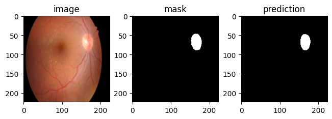

# RETINOPATHY
This project segments the optical disk of fundus images using the UNet architecture (based on `pytorch` and `segmentation_models_pytorch`).

## Dataset
This project uses the dataset from the [IDRiD Diabetic Retinopathy - Segmentation and Grading Challenge](https://idrid.grand-challenge.org/Data/). The dataset consists of 516 images, which were captured and graded by a clinician. A license is provided for the data. 
Specifically, the segmentation dataset consists of 81 RBG images, sized 2848 x 4288; 54 are in the training set and 27 are in the training set. There are corresponding ground truth binary masks for all images, showing the optical disc. It should be noted that due to the small dataset, the "testing set" is used as a validation set during model and hyperparameter tuning and a testing set for final inference. 

## Methods
The following steps are taken:
* Set-up
    * Import necessary libraries
    * Organize and import images and folders
    * Explore available data
* Data pre-processing
    * Augmentation on training and testing set - resize images to 224 x 224, perform random flips/rotations/color jitters (only for images in training set), convert to tensors, normalize for UNet model
    * Load into batches of 16 
* Create segmentation model via custom class which uses UNet architecture and (Dic Loss + BCE Loss)
    * Baseline model based on "resnet34" encoder, learning rate of 0.001 and 5 epochs to explore overall model performance 
    * Hyperparameter tuning over 20 epochs of:
        * encoders: resnet34, efficientnet-b0, mobileone_s0
        * learning rate: 0.001, 0.0001
    * Best model based on results of hyperparameter tuning
        * Looking at training and validation losses over time/training epochs
        * Inference with best model for final evaluation

## Results and Conclusion
The best model trained over 20 epochs used **resnet34** as the encoder, and a earnin rate of **0.001**; this resulted in a final training loss of 0.1959 and a final validation loss of 0.2061. For the testing set, the average Dice Loss was 0.17 and the average BCE Loss was 0.0096.
An example of inference with this model can be seen on an example image from the testing set:

The model can accurately segment the optical disc with an accuracy of about 83% (based on the Dice Loss), which is a good result. 

### Next Steps
Ideas for next steps include:
* Changing the loss of the training model to weight Dice Loss more importantly than BCE Loss, as that could improve segmentation due to the class imbalance/"small" proportion of positive mask in the image
* Exploring more hyperparameters (e.g. other encoders, momentum, number of epochs, etc.)
* Finding bounding box of the optical disk
* Multi-class/multi-mask segmentation (e.g. segmenting soft/hard exudates, microaneurysms, etc.)